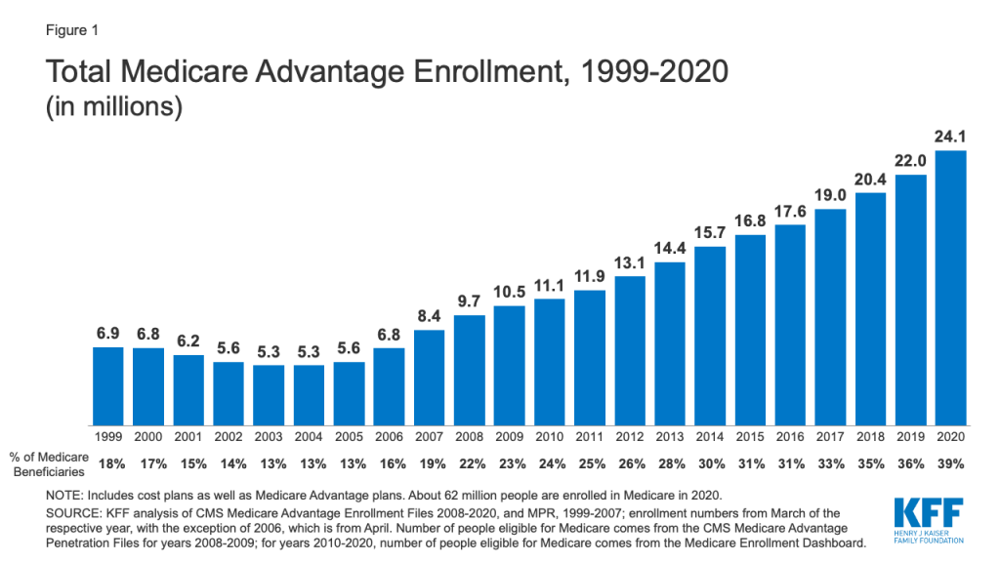
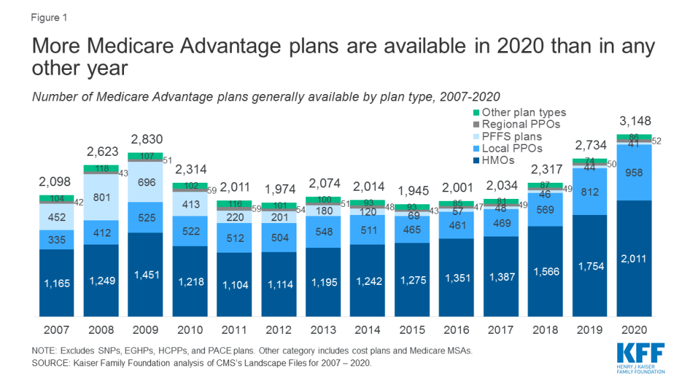
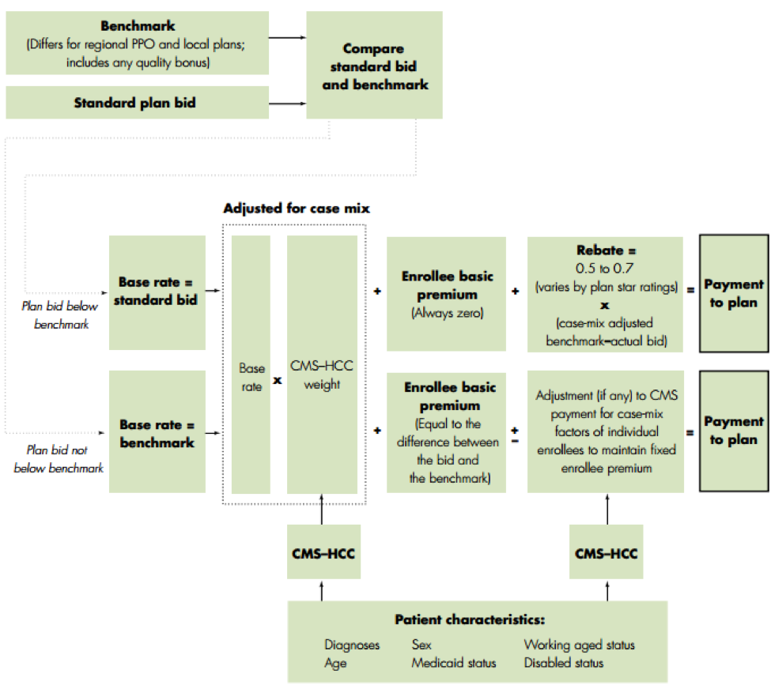

class: inverse, center, middle


<!-- Adjust some CSS code for font size, maintain R code font size -->
<style type="text/css">
.remark-slide-content {
    font-size: 30px;
    padding: 1em 2em 1em 2em;    
}
.remark-code, .remark-inline-code { 
    font-size: 20px;
}
</style>


<!-- Set R options for how code chunks are displayed and load packages -->
```{r setup, include=FALSE}
options(htmltools.dir.version = FALSE)
options(dplyr.summarise.inform = FALSE)
library(knitr)
opts_chunk$set(
  fig.align="center",  
  fig.height=3, #fig.width=6,
  # out.width="748px", #out.length="520.75px",
  dpi=300, #fig.path='Figs/',
  cache=T#, echo=F, warning=F, message=F
  )

knitr::opts_hooks$set(fig.callout = function(options) {
  if(options$fig.callout) {
    options$echo = FALSE
  }
  options
})

if (!require("pacman")) install.packages("pacman")
pacman::p_load(tidyverse, ggplot2, dplyr, lubridate, readr, readxl, hrbrthemes,scales, gganimate, gapminder, gifski, png, tufte, plotly, OECD, ggrepel, xaringanExtra, webshot)
```


```{r xaringan-scribble, echo=FALSE}
xaringanExtra::use_scribble(rgb(0.9, 0.5, 0.5))
```

# What's the point?

<html><div style='float:left'></div><hr color='#EB811B' size=1px width=1055px></html>


---
# 1. Types of quality disclosure

- Self-disclosed quality via advertising
- Word-of-mouth and aggregated reviews form users (Google, Rotten Tomatoes, etc.)
- Third-party rating agencies
- **Government regulation via mandated disclosure or licensing**


---
# 2. Endogenous quality (Spence, 1975)

- **Setting:** Monopoly (or oligopoly) when firms set both price and quality
- **Intuition:** Firm invests to the point where marginal quality valuation meets marginal costs of quality, but socially optimal quality depends on average valuation
- **Takeaway:** Profit-maximizing quality will differ from socially optimal quality when the marginal customer is not representative of the average

--

Natural in the presence of adverse selection, where the marginal patient is almost always different from the average patient


---
# The main idea

- Need some form of quality disclosure to aid decision making
- Full-disclosure likely yields under-investment in quality

--

- Regulator can improve quality via coarse rating scores
- but...firms will respond to the scoring design accordingly


---
class: inverse, center, middle

# Context

<html><div style='float:left'></div><hr color='#EB811B' size=1px width=1055px></html>

---
# Medicare Advantage

.pull-left[
  
]

.pull-right[
  
]

---
# Quality disclosure in Medicare Advantage

snapshots of online plan finder


---
class: inverse, center, middle

# Preview of findings

<html><div style='float:left'></div><hr color='#EB811B' size=1px width=1055px></html>

---
class: clear

1. Estimate structural model of price **and quality investments**
2. Identify optimal scoring design

--

figure showing final result


---
# Some points of applause

- Substantial contribution here
- Highly policy relevant

--

"To address this, I completed the data by reviewing a decade of public communications by CMS aimed at insurers. I recover year-to-year changes to the scoring design, **replicating the public scoring assignment perfectly.**"


---
class: inverse, center, middle

# Basic setup

<html><div style='float:left'></div><hr color='#EB811B' size=1px width=1055px></html>


---
class: clear

```{tikz tikz-timeline, echo=FALSE, fig.ext='png', cache=TRUE}
\begin{tikzpicture}[scale=1]
		% time line
		\draw [thick,->, color=black] (0,0) -- (12.2,0);
		\node[align=right, color=black] at (12.4, 0) {t};
		
		% First stage
		\draw[thick, color=black] (0, 3pt) -- (0, -3pt);
		\node[align=center, color=black] at (0,-0.3) {1};
	
		
		% Second stage
		\draw[thick, color=black] (3, 3pt) -- (3, -3pt);
		\node[align=center, color=black] at (3,-0.3) {2};

		
		% Nature realization
		\draw[thick, color=black] (6, 3pt) -- (6, -3pt);

		
		% Third stage
		\draw[thick, color=black] (9, 3pt) -- (9, -3pt);
		\node[align=center, color=black] at (9,-0.3) {3};
		

		% Fourth stage
		\draw[thick, color=black] (12, 3pt) -- (12, -3pt);
		\node[align=center, color=black] at (12,-0.3) {4};

    % Labels
    \node[align=center, color=gray] at (0,.5) {Scoring $\psi$};
		\node[align=center, color=gray] at (3,.5) {Investments $\boldsymbol{x}$};
		\node[align=center, color=gray] at (6,.5) {Quality $\boldsymbol{q} \sim F(\cdot|\boldsymbol{x})$};
		\node[align=center, color=gray] at (9,.5) {Prices $\boldsymbol{p}$};
		\node[align=center, color=gray] at (12,.5) {$D(\boldsymbol{p}, \psi(\boldsymbol{q}), \psi)$};

\end{tikzpicture}
```

---
class: clear

```{tikz tikz-new, echo=FALSE, fig.ext='png', cache=TRUE}
\begin{tikzpicture}[scale=1]
		% time line
		\draw [thick,->, color=black] (0,0) -- (12.2,0);
		\node[align=right, color=black] at (12.4, 0) {t};
		
		% First stage
		\draw[thick, color=black] (0, 3pt) -- (0, -3pt);
		\node[align=center, color=black] at (0,-0.3) {1};
	
		
		% Second stage
		\draw[thick, color=black] (3, 3pt) -- (3, -3pt);
		\node[align=center, color=black] at (3,-0.3) {2};

		
		% Nature realization
		\draw[thick, color=black] (6, 3pt) -- (6, -3pt);

		
		% Third stage
		\draw[thick, color=black] (9, 3pt) -- (9, -3pt);
		\node[align=center, color=black] at (9,-0.3) {3};
		

		% Fourth stage
		\draw[thick, color=black] (12, 3pt) -- (12, -3pt);
		\node[align=center, color=black] at (12,-0.3) {4};

    % Labels
    \node[align=center, color=orange] at (0,.5) {Scoring $\psi$};
		\node[align=center, color=orange] at (3,.5) {Investments $\boldsymbol{x}$};
		\node[align=center, color=gray!50!orange] at (6,.5) {Quality $\boldsymbol{q} \sim F(\cdot|\boldsymbol{x})$};
		\node[align=center, color=gray] at (9,.5) {Prices $\boldsymbol{p}$};
		\node[align=center, color=gray] at (12,.5) {$D(\boldsymbol{p}, \psi(\boldsymbol{q}), \psi)$};

\end{tikzpicture}
```

**What's new here?**
- Endogenous quality investments with imperfect mapping into quality scores
- Endogenous scoring design


---
class: clear

```{tikz tikz-4, echo=FALSE, fig.ext='png', cache=TRUE}
\begin{tikzpicture}[scale=1]
		% time line
		\draw [thick,->, color=black] (0,0) -- (12.2,0);
		\node[align=right, color=black] at (12.4, 0) {t};
		
		% First stage
		\draw[thick, color=black] (0, 3pt) -- (0, -3pt);
		\node[align=center, color=black] at (0,-0.3) {1};
	
		
		% Second stage
		\draw[thick, color=black] (3, 3pt) -- (3, -3pt);
		\node[align=center, color=black] at (3,-0.3) {2};

		
		% Nature realization
		\draw[thick, color=black] (6, 3pt) -- (6, -3pt);

		
		% Third stage
		\draw[thick, color=black] (9, 3pt) -- (9, -3pt);
		\node[align=center, color=black] at (9,-0.3) {3};
		

		% Fourth stage
		\draw[thick, color=black] (12, 3pt) -- (12, -3pt);
		\node[align=center, color=black] at (12,-0.3) {4};

    % Labels
    \node[align=center, color=gray] at (0,.5) {Scoring $\psi$};
		\node[align=center, color=gray] at (3,.5) {Investments $\boldsymbol{x}$};
		\node[align=center, color=gray] at (6,.5) {Quality $\boldsymbol{q} \sim F(\cdot|\boldsymbol{x})$};
		\node[align=center, color=gray] at (9,.5) {Prices $\boldsymbol{p}$};
		\node[align=center, color=orange] at (12,.5) {$D(\boldsymbol{p}, \psi(\boldsymbol{q}), \psi)$};

\end{tikzpicture}
```

$$u_{ij} = \underbrace{\alpha_i P_{j}}_{\text{premium}} + \underbrace{\beta_i b_{j}}_{\text{coverage}} + \underbrace{\mathcal{E}_{\psi}[\boldsymbol{\gamma}'\boldsymbol{q}|\psi(q_{j})]}_{\text{quality}}  + \underbrace{\lambda'z_{ij}}_{\substack{\text{Obs.}\\\text{attributes}}} + \underbrace{\xi_{j}}_{\substack{\text{unobs.}\\\text{preferences}}} + \underbrace{\varepsilon_{ij}}_{\sim \text{T1EV}}$$


---
class: clear

```{tikz tikz-3, echo=FALSE, fig.ext='png', cache=TRUE}
\begin{tikzpicture}[scale=1]
		% time line
		\draw [thick,->, color=black] (0,0) -- (12.2,0);
		\node[align=right, color=black] at (12.4, 0) {t};
		
		% First stage
		\draw[thick, color=black] (0, 3pt) -- (0, -3pt);
		\node[align=center, color=black] at (0,-0.3) {1};
	
		
		% Second stage
		\draw[thick, color=black] (3, 3pt) -- (3, -3pt);
		\node[align=center, color=black] at (3,-0.3) {2};

		
		% Nature realization
		\draw[thick, color=black] (6, 3pt) -- (6, -3pt);

		
		% Third stage
		\draw[thick, color=black] (9, 3pt) -- (9, -3pt);
		\node[align=center, color=black] at (9,-0.3) {3};
		

		% Fourth stage
		\draw[thick, color=black] (12, 3pt) -- (12, -3pt);
		\node[align=center, color=black] at (12,-0.3) {4};

    % Labels
    \node[align=center, color=gray] at (0,.5) {Scoring $\psi$};
		\node[align=center, color=gray] at (3,.5) {Investments $\boldsymbol{x}$};
		\node[align=center, color=gray] at (6,.5) {Quality $\boldsymbol{q} \sim F(\cdot|\boldsymbol{x})$};
		\node[align=center, color=orange] at (9,.5) {Prices $\boldsymbol{p}$};
		\node[align=center, color=gray] at (12,.5) {$D(\boldsymbol{p}, \psi(\boldsymbol{q}), \psi)$};

\end{tikzpicture}
```

$$\pi_{f}(\boldsymbol{q}, \psi) = \max_{\{p_j\}_{j \in J_{f}}} \sum_{j \in J_{f}}\underbrace{D_{j}(\boldsymbol{p}, \psi(\boldsymbol{q}))}_{\text{demand}} (\underbrace{R_j(p_j)}_{\text{mg. revenue}} - \underbrace{C(\boldsymbol{q}_j, \boldsymbol{z}_{j}, \boldsymbol{\theta}_j)}_{\text{mg. cost}})$$

---
class: clear

```{tikz tikz-2, echo=FALSE, fig.ext='png', cache=TRUE}
\begin{tikzpicture}[scale=1]
		% time line
		\draw [thick,->, color=black] (0,0) -- (12.2,0);
		\node[align=right, color=black] at (12.4, 0) {t};
		
		% First stage
		\draw[thick, color=black] (0, 3pt) -- (0, -3pt);
		\node[align=center, color=black] at (0,-0.3) {1};
	
		
		% Second stage
		\draw[thick, color=black] (3, 3pt) -- (3, -3pt);
		\node[align=center, color=black] at (3,-0.3) {2};

		
		% Nature realization
		\draw[thick, color=black] (6, 3pt) -- (6, -3pt);

		
		% Third stage
		\draw[thick, color=black] (9, 3pt) -- (9, -3pt);
		\node[align=center, color=black] at (9,-0.3) {3};
		

		% Fourth stage
		\draw[thick, color=black] (12, 3pt) -- (12, -3pt);
		\node[align=center, color=black] at (12,-0.3) {4};

    % Labels
    \node[align=center, color=gray] at (0,.5) {Scoring $\psi$};
		\node[align=center, color=orange] at (3,.5) {Investments $\boldsymbol{x}$};
		\node[align=center, color=gray] at (6,.5) {Quality $\boldsymbol{q} \sim F(\cdot|\boldsymbol{x})$};
		\node[align=center, color=gray] at (9,.5) {Prices $\boldsymbol{p}$};
		\node[align=center, color=gray] at (12,.5) {$D(\boldsymbol{p}, \psi(\boldsymbol{q}), \psi)$};

\end{tikzpicture}
```


$$\max_{\boldsymbol{x}_f \in \mathbb{R}^{|\mathcal{Q}| \times |J_f|}}  \underbrace{\int  E\left[\pi_{f}(\boldsymbol{q}_f, \boldsymbol{q}_{-f}, \psi)\right] dF(\boldsymbol{q}_f|\boldsymbol{x}_f)}_{\text{expected insurance profit}} - \underbrace{I(\boldsymbol{x}_f, \boldsymbol{\mu}_{\boldsymbol{f}})}_{\text{investment cost}}$$


---
class: clear

```{tikz tikz-1, echo=FALSE, fig.ext='png', cache=TRUE}
\begin{tikzpicture}[scale=1]
		% time line
		\draw [thick,->, color=black] (0,0) -- (12.2,0);
		\node[align=right, color=black] at (12.4, 0) {t};
		
		% First stage
		\draw[thick, color=black] (0, 3pt) -- (0, -3pt);
		\node[align=center, color=black] at (0,-0.3) {1};
	
		
		% Second stage
		\draw[thick, color=black] (3, 3pt) -- (3, -3pt);
		\node[align=center, color=black] at (3,-0.3) {2};

		
		% Nature realization
		\draw[thick, color=black] (6, 3pt) -- (6, -3pt);

		
		% Third stage
		\draw[thick, color=black] (9, 3pt) -- (9, -3pt);
		\node[align=center, color=black] at (9,-0.3) {3};
		

		% Fourth stage
		\draw[thick, color=black] (12, 3pt) -- (12, -3pt);
		\node[align=center, color=black] at (12,-0.3) {4};

    % Labels
    \node[align=center, color=orange] at (0,.5) {Scoring $\psi$};
		\node[align=center, color=gray] at (3,.5) {Investments $\boldsymbol{x}$};
		\node[align=center, color=gray] at (6,.5) {Quality $\boldsymbol{q} \sim F(\cdot|\boldsymbol{x})$};
		\node[align=center, color=gray] at (9,.5) {Prices $\boldsymbol{p}$};
		\node[align=center, color=gray] at (12,.5) {$D(\boldsymbol{p}, \psi(\boldsymbol{q}), \psi)$};

\end{tikzpicture}
```

- No objective function imposed on regulator
- Once set, scoring design is known to insurers and beneficiaries

---
class: inverse, center, middle

# Considerations for this paper

<html><div style='float:left'></div><hr color='#EB811B' size=1px width=1055px></html>


---
# Who knows what?

- Insurers are probably sufficiently aware of scoring design...are beneficiaries?


---
# The bid process

.center[
  
]

--

Separate bids for Part D benefits

---
# Contracts vs plans

- Beneficiaries choose plans, defined by specific premium and benefits
- Quality is measured by contract

--

- Paper argues that there is really only one plan per contract
    - Makes sense in recent years but maybe not in early years
    - Is this true in all years?
- Can't have it both ways
    - Price variation within contract good
    - but product differentiation within given quality score irrelevant?

---
# Scoring design

Does the setup incorporate...

- Bonuses for high scores? **No**
- Contract consolidation of plans? **No**
- Penalty for high-variance contracts? **Maybe**


---
# Scoring design

More fundamental questions...

- Are ratings reflective of quality?
- Is the rating monotonically increasing in underlying quality?

---
class: clear


.center[
  
]


---
class: inverse, center, middle

# Considerations for more papers

<html><div style='float:left'></div><hr color='#EB811B' size=1px width=1055px></html>


---
# 1. Measuring quality

- What's the best way to measure the underlying quality score?
- Many of the current measures are provider (network) specific

---
# 2. Policy uncertainty

- Can some policy uncertainty avoid bunching just above the threshold values?
- How much policy uncertainty is optimal?
- How do insurers respond to such uncertainty?

--

- Already in the model: mapping between quality investments and the quality score
- Already in the data: introduction of new measures and publication of specific threshold values for some measures

---
# 3. Learning about scoring designs

- The scoring designs are complicated
- Likely takes time for insurers to understand the policy and update plans/contracts accordingly