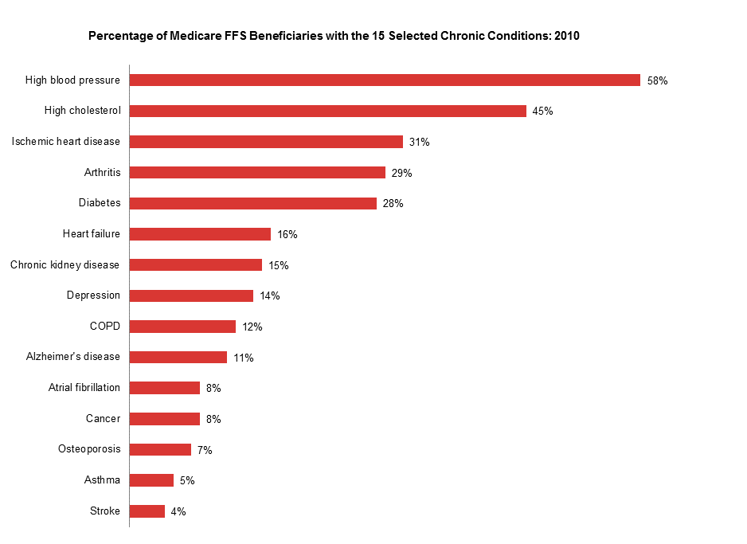
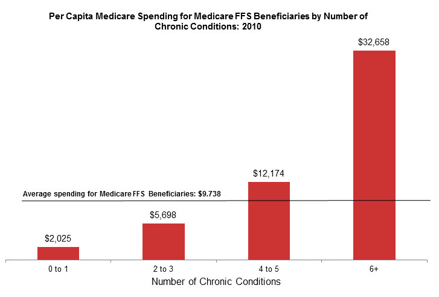

<!-- Adjust some CSS code for font size, maintain R code font size -->
<style type="text/css">
.remark-slide-content {
    font-size: 30px;
    padding: 1em 2em 1em 2em;    
}
.remark-code, .remark-inline-code { 
    font-size: 20px;
}
</style>


<!-- Set R options for how code chunks are displayed and load packages -->
```{r setup, include=FALSE}
options(htmltools.dir.version = FALSE)
options(dplyr.summarise.inform = FALSE)
library(knitr)
opts_chunk$set(
  fig.align="center",  
  fig.height=3, #fig.width=6,
  # out.width="748px", #out.length="520.75px",
  dpi=300, #fig.path='Figs/',
  cache=T#, echo=F, warning=F, message=F
  )

knitr::opts_hooks$set(fig.callout = function(options) {
  if(options$fig.callout) {
    options$echo = FALSE
  }
  options
})

if (!require("pacman")) install.packages("pacman")
pacman::p_load(tidyverse, ggplot2, dplyr, lubridate, readr, readxl, hrbrthemes,scales, gganimate, gapminder, gifski, png, tufte, plotly, OECD, ggrepel, xaringanExtra, webshot)
```


```{r xaringan-scribble, echo=FALSE}
xaringanExtra::use_scribble(rgb(0.9, 0.5, 0.5))
```


# Medicare Chronic Conditions Data

[CMS Link to Dashboard](https://www.cms.gov/Research-Statistics-Data-and-Systems/Statistics-Trends-and-Reports/Chronic-Conditions/CCDashboard)

---
count: false

# Medicare Chronic Conditions Data

.center[
  
]
 
 
---
count: false


# Medicare Chronic Conditions Data

.center[
  
]
 

---
# What we can learn from this paper

If we want to improve Medicare to better shield beneficiaries from financial implications of illness...

- Need to know areas of greatest weakness (high OOP spending)
- Need to identify types of spending
- Suggest *why* spending is high in certain areas


---
# Questions and future directions

- What is the estimand?
- Is there a "cleaner" comparison (e.g., those with newly diagnosed CVD versus those with no chronic disease)?
- Prescription drugs are biggest culprit, but what does this mean for policy?
  - Are people not buying Part D even though they "should"?