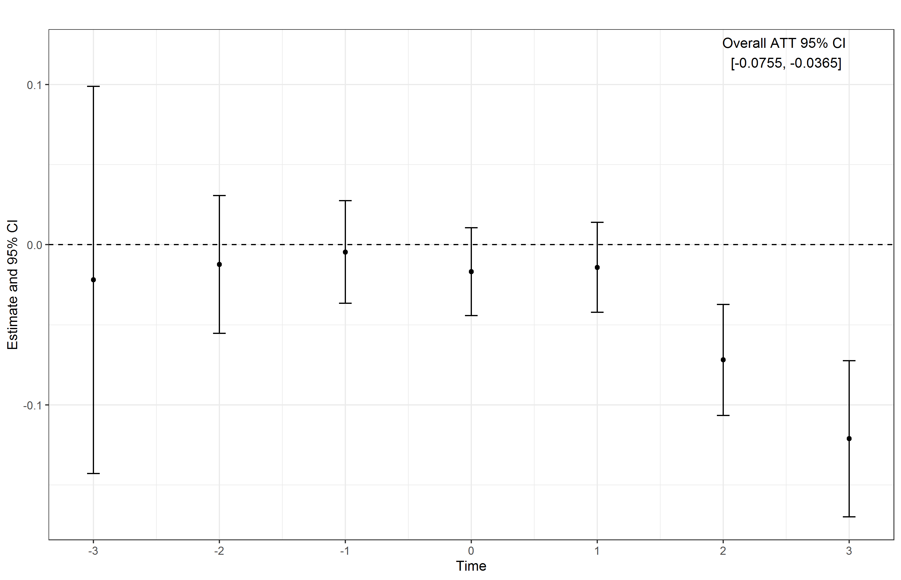

<!-- Adjust some CSS code for font size, maintain R code font size -->
<style type="text/css">
.remark-slide-content {
    font-size: 30px;
    padding: 1em 2em 1em 2em;    
}
.remark-code, .remark-inline-code { 
    font-size: 20px;
}
</style>


<!-- Set R options for how code chunks are displayed and load packages -->
```{r setup, include=FALSE}
options(htmltools.dir.version = FALSE)
options(dplyr.summarise.inform = FALSE)
library(knitr)
opts_chunk$set(
  fig.align="center",  
  fig.height=3, #fig.width=6,
  # out.width="748px", #out.length="520.75px",
  dpi=300, #fig.path='Figs/',
  cache=T#, echo=F, warning=F, message=F
  )

knitr::opts_hooks$set(fig.callout = function(options) {
  if(options$fig.callout) {
    options$echo = FALSE
  }
  options
})

if (!require("pacman")) install.packages("pacman")
pacman::p_load(tidyverse, ggplot2, dplyr, lubridate, readr, readxl, hrbrthemes,
               scales, gganimate, gapminder, gifski, png, tufte, plotly, OECD,
               ggrepel, xaringanExtra, webshot)
```


```{r xaringan-scribble, echo=FALSE}
xaringanExtra::use_scribble(rgb(0.9, 0.5, 0.5))
```


# Health care in the U.S.

.center[
<iframe width="800" height="500" src="https://www.youtube.com/embed/u2AFI_M-QGg?start=135&end=197" frameborder="0" allowfullscreen></iframe>
]


---
class: inverse

# Outline of talk

1. [Background](#background)
2. [Health Insurance Choice](#insurance)
3. [Vertical Integration](#integration)
4. [Physician Learning and Referrals](#referrals)


---
class: inverse, center, middle
name: background

# Personal background

<html><div style='float:left'></div><hr color='#EB811B' size=1px width=1055px></html>

---
# Background

.pull-left[
  - From Howe, TX
]

.pull-right[
  
]

---
count: false


# Background

.pull-left[
  - From Howe, TX
  - Undergrad at the University of North Texas
]

.pull-right[
  
]


---
count: false

# Background

.pull-left[
  - From Howe, TX
  - Undergrad at the University of North Texas
  - PhD at Indiana University
]

.pull-right[
  
]


---
count: false

# Background

.pull-left[
  - From Howe, TX
  - Undergrad at the University of North Texas
  - PhD at Indiana University
  - FTI Consulting, Dallas, TX
]

.pull-right[
  
]


---
count: false

# Background

.pull-left[
  - From Howe, TX
  - Undergrad at the University of North Texas
  - PhD at Indiana University
  - FTI Consulting, Dallas, TX
  - Baylor Scott and White Health Care, Dallas, TX
]

.pull-right[
  
]


---
count: false

# Background

.pull-left[
  - From Howe, TX
  - Undergrad at the University of North Texas
  - PhD at Indiana University
  - FTI Consulting, Dallas, TX
  - Baylor Scott and White Health Care, Dallas, TX
  - Emory University
]

.pull-right[
  
]


---
class: inverse, center, middle
name: insurance

# Health insurance

<html><div style='float:left'></div><hr color='#EB811B' size=1px width=1055px></html>

---
# Decision making

- [Search Costs and Medicare Plan Choice](https://onlinelibrary.wiley.com/doi/abs/10.1002/hec.1539), **Health Economics**, 2010
- [Decision Assistance and Steering in the ACA Exchanges](https://imccart.github.io/ACA-Decision-Support/), Working Project


---
# Quality disclosure

- [The Star Treatment: Estimating the Impact of Star Ratings on Medicare Advantage Enrollments](http://jhr.uwpress.org/content/50/4/980.abstract), **Journal of Human Resources**, 2015
- [Supply-side Responses to Public Quality Ratings: Evidence from Medicare Advantage](https://www.journals.uchicago.edu/doi/abs/10.1162/AJHE_a_00070), **American Journal of Health Economics**, 2017
- [Quality Disclosure and the Timing of Insurers' Adjustments: Evidence from Medicare Advantage](https://www.sciencedirect.com/science/article/pii/S0167629617310433), **Journal of Health Economics**, 2018

---
# Competition

.center[
  
  ]
---
count: false

# Competition

[Multimarket contact in health insurance: Evidence from Medicare Advantage](https://www.nber.org/papers/w24486), revise and resubmit at **Journal of Industrial Economics**

--
.pull-left[
  
]

.pull-right[
  
]

---
class: inverse, center, middle
name: integration

# Vertical integration

<html><div style='float:left'></div><hr color='#EB811B' size=1px width=1055px></html>


---
# Sources and effects of VI

.center[
  
]

---
count: false

# Sources and effects of VI

[Hospital Pricing Following Integration with Physician Practices](https://www.sciencedirect.com/science/article/pii/S0167629621000291), **Journal of Health Economics**, 2021

.center[
  
]


---
count: false

# Sources and effects of VI

[Owning the Agent: Hospital Influence on Physician Behaviors](https://www.nber.org/papers/w28859), Working Paper

.pull-left[
Integration and payments:

  
]

.pull-right[
Integration and claims:

  
]


---
class: inverse, center, middle
name: referrals

# Physician referrals 

<html><div style='float:left'></div><hr color='#EB811B' size=1px width=1055px></html>


---
# Physician referrals

.pull-left[
  
]

.pull-right[
  
]

---
count: false

# Physician referrals

1. Do PCPs learn about specialist quality and update referral patterns accordingly?
2. Can we improve this learning process? How?


---
class: inverse, center, middle
name: hospitals

# Hospital pricing

<html><div style='float:left'></div><hr color='#EB811B' size=1px width=1055px></html>


---
# Pricing and pay for performance

.center[
  
]


---
# Pricing and specialization

.pull-left[
  
]

.pull-right[
  
]
