<!-- Adjust some CSS code for font size, maintain R code font size -->
<style type="text/css">
.remark-slide-content {
    font-size: 30px;
    padding: 1em 2em 1em 2em;    
}
.remark-code, .remark-inline-code { 
    font-size: 20px;
}
</style>


<!-- Set R options for how code chunks are displayed and load packages -->
```{r setup, include=FALSE}
options(htmltools.dir.version = FALSE)
options(dplyr.summarise.inform = FALSE)
library(knitr)
opts_chunk$set(
  fig.align="center",  
  fig.height=3, #fig.width=6,
  # out.width="748px", #out.length="520.75px",
  dpi=300, #fig.path='Figs/',
  cache=T#, echo=F, warning=F, message=F
  )

knitr::opts_hooks$set(fig.callout = function(options) {
  if(options$fig.callout) {
    options$echo = FALSE
  }
  options
})

if (!require("pacman")) install.packages("pacman")
pacman::p_load(tidyverse, ggplot2, dplyr, lubridate, readr, readxl, hrbrthemes,
               scales, gganimate, gapminder, gifski, png, tufte, plotly, OECD,
               ggrepel, xaringanExtra)
```


```{r xaringan-scribble, echo=FALSE}
xaringanExtra::use_scribble(rgb(0.9, 0.5, 0.5))
```

# Health care in the U.S.

.center[
<iframe width="800" height="500" src="https://www.youtube.com/embed/u2AFI_M-QGg?start=135&end=197" frameborder="0" allowfullscreen></iframe>
]

---
class: inverse

# Some thought on U.S. health care...

1. [Quality is "Meh"](#health)

2. [Lots of reasons](#complex)

3. [Economics can help](#economics)

4. [What we're doing at Emory](#emory)

<!-- New Section -->
---
class: inverse, center, middle
name: health

# Spending and Quality

<html><div style='float:left'></div><hr color='#EB811B' size=1px width=1055px></html>


---
# Health improvements worldwide

```{r life-exp, echo=FALSE}
library(gapminder)
gapminder %>%
  group_by(year) %>%
  summarize(lifeExp = median(lifeExp),
            gdpMed = median(gdpPercap)) %>%
  ggplot(aes(year,lifeExp)) + geom_line(alpha = 1/3) + theme_bw() +
    labs(x = "Year",
         y = "Life Expectancy (years)",
         title = "Median life expectancy across the world")
```


---
# But the U.S. is unique

.center[
  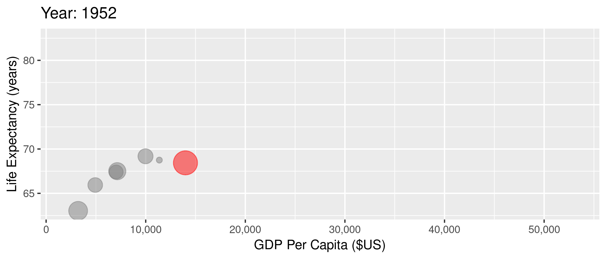
]


---
# The U.S. has very high spending

.center[
  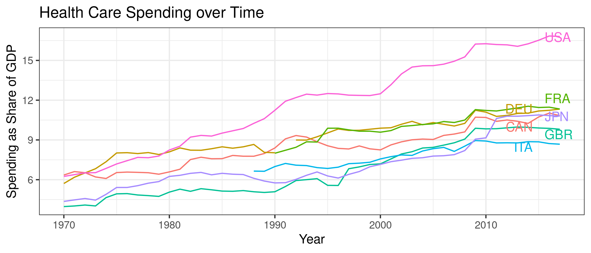
]


---
# And our spending doesn't pay off in some areas


.center[
  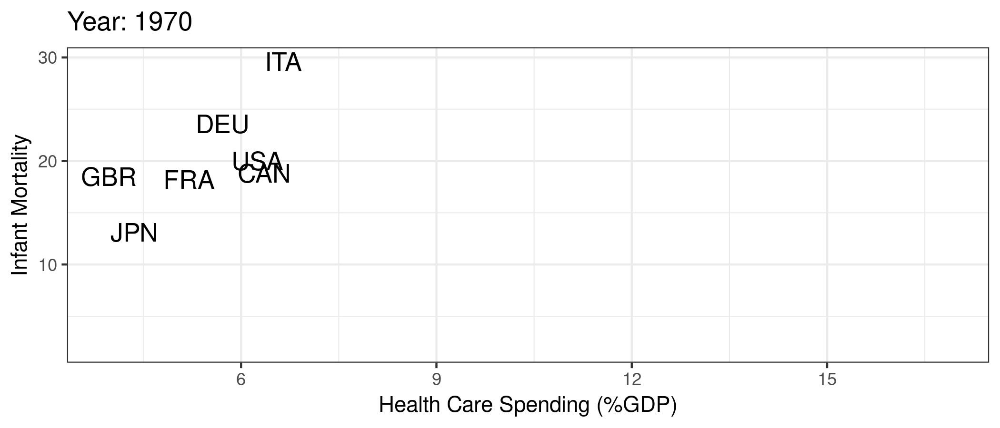
]


---
# And our spending doesn't pay off in some areas


.center[
  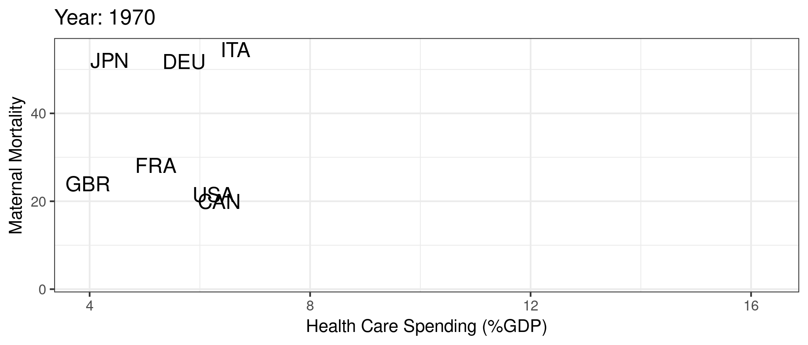
]


<!-- New Section -->
---
class: inverse, center, middle
name: complex

# Why?

<html><div style='float:left'></div><hr color='#EB811B' size=1px width=1055px></html>


---
# 1. Too many uninsured

.center[
  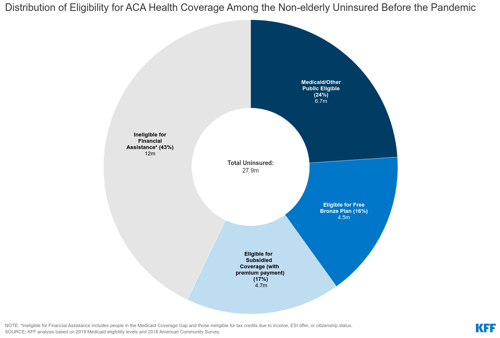
]

---
# 2. Really high prices

.center[

]

---
# 2. Really high prices

.center[
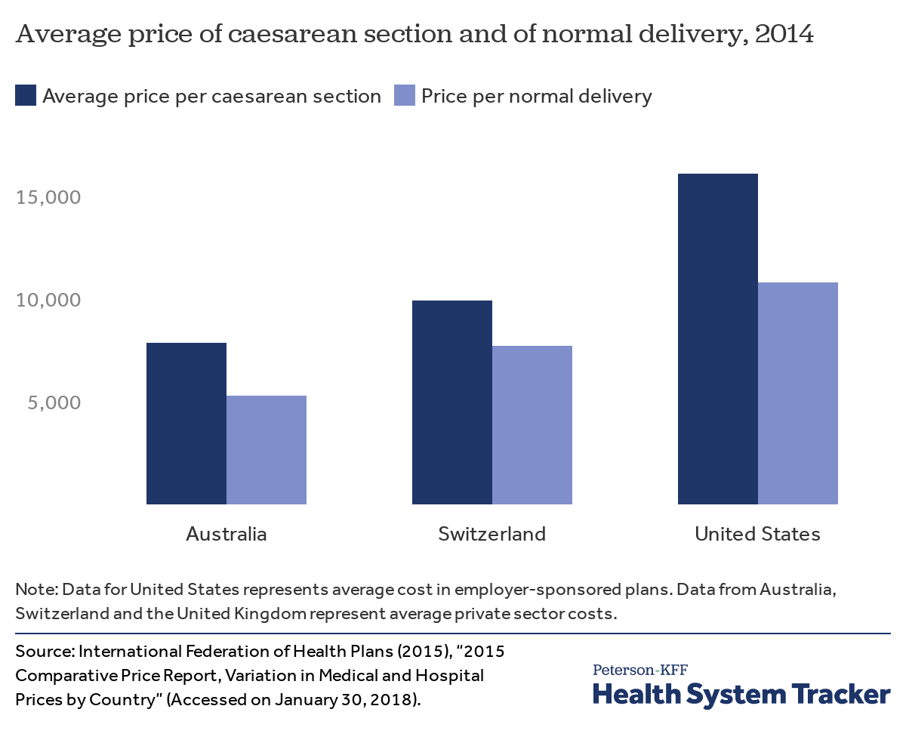
]

---
# 2. Really high prices

.center[
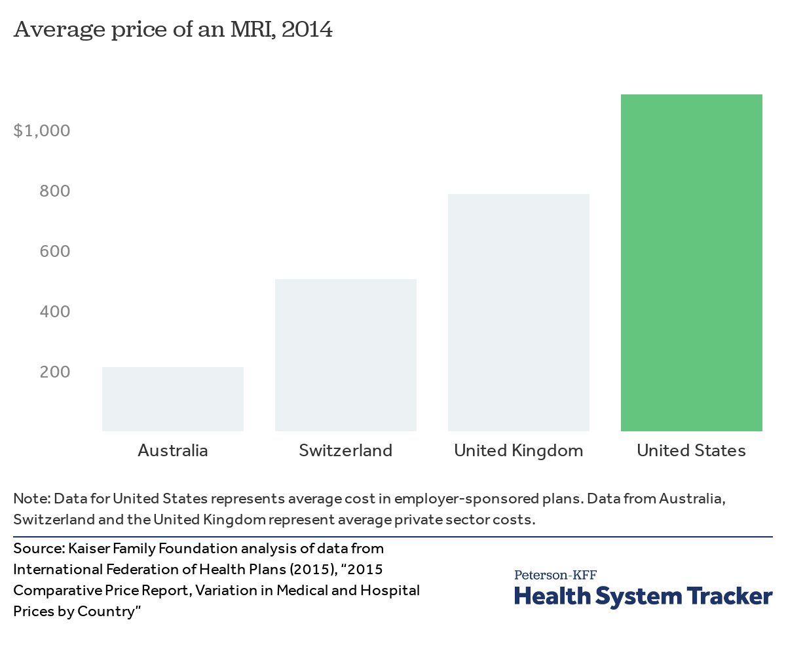
]

---
# 2. Really high prices

.center[
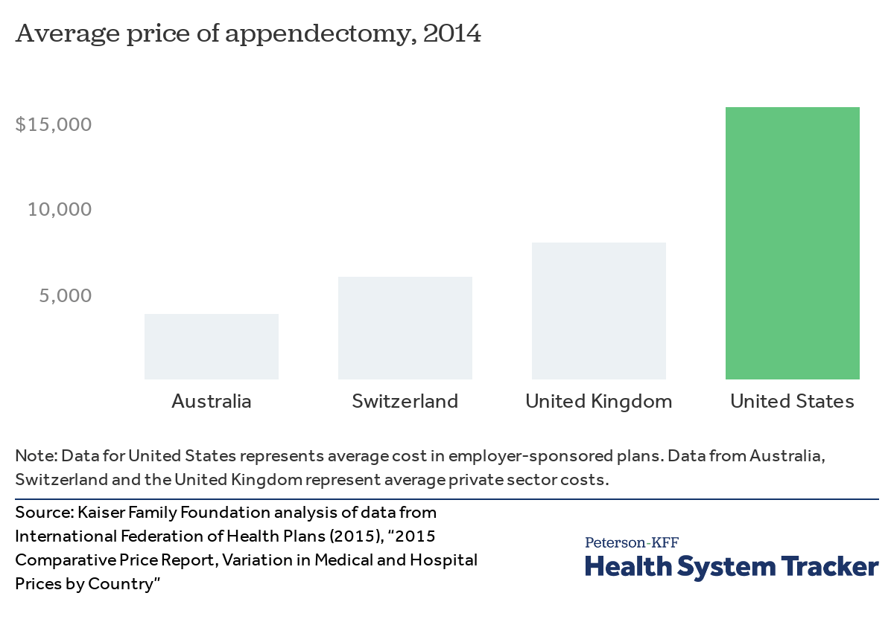
]

---
# 2. Really high prices

.center[
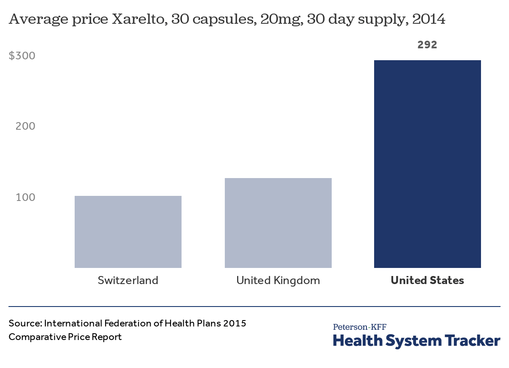
]


---
# 3. Variation in quantity

.pull-left[
  
]

.pull-right[
  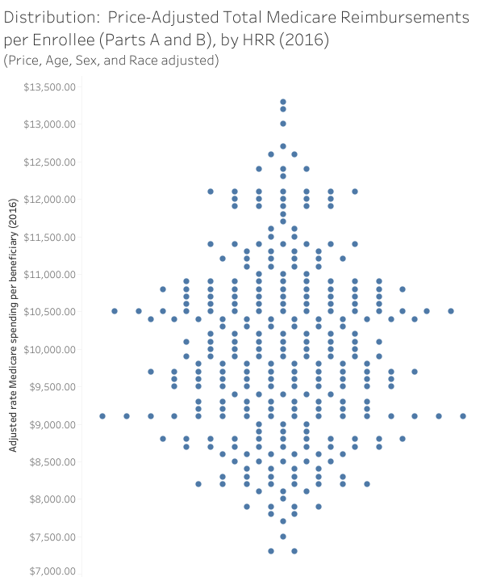
]


---
# 4. Variation in prices

Some variation due to different "prices" for different people

- Negotiation with private insurers (bargaining problem)
- Set payment from Medicare and Medicaid
  - Medicaid managed care (80%)
  - Medicare Advantage (45%)
- Uninsured patients (charge amounts)

--

.center[
Price $\neq$ charge $\neq$ cost $\neq$ patient out-of-pocket spending
]


---
# 4. Variation in prices

.center[
  
]

<div class="smalltext">Source: <a href="https://healthcarepricingproject.org/">Health Care Pricing Project</a></div>


---
# 4. Variation in prices


.pull-left[
  
]

.pull-right[
  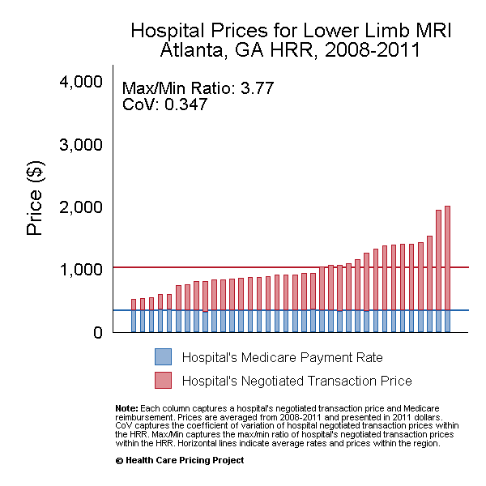
]


<div class="smalltext">Source: <a href="https://healthcarepricingproject.org/">Health Care Pricing Project</a></div>


<!-- New Section -->
---
class: inverse, center, middle
name: economics

# Where does economics fit in here?

<html><div style='float:left'></div><hr color='#EB811B' size=1px width=1055px></html>


---
# Health care and economics (in general)

Lots of interesting economic issues in health care (not all unique to the U.S.):

--

1. Extremely heterogeneous products
2. Asymmetric information between patients and physicians
3. Unobservable quality (experience good)
4. Unpredictable need (inability to shop in many cases)
5. Distortion of incentives due to insurance
6. Adverse selection (asymmetric information between patients and insurers)

---
# How is the U.S. unique?

These factors exist in other markets and in other countries, but...


--

- Health care is unique in the combination of these issues
- U.S. is unique in the extent of these issues in health care (policy problems)
- We have a market based system but **without much competition**...


---
# Trends in competitiveness
Almost any way you define it, hospital markets are more and more concentrated (less competitive) in recent decades.
- 1990: 65% of MSAs highly concentrated, 23% unconcentrated
- 2006: 77% highly concentrated, 11% unconcentrated


---
# Hospital concentration over time

.pull-left[
  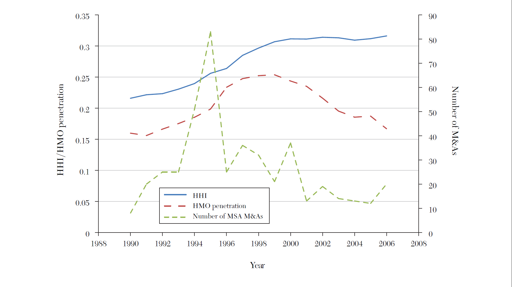
]

.pull-right[
  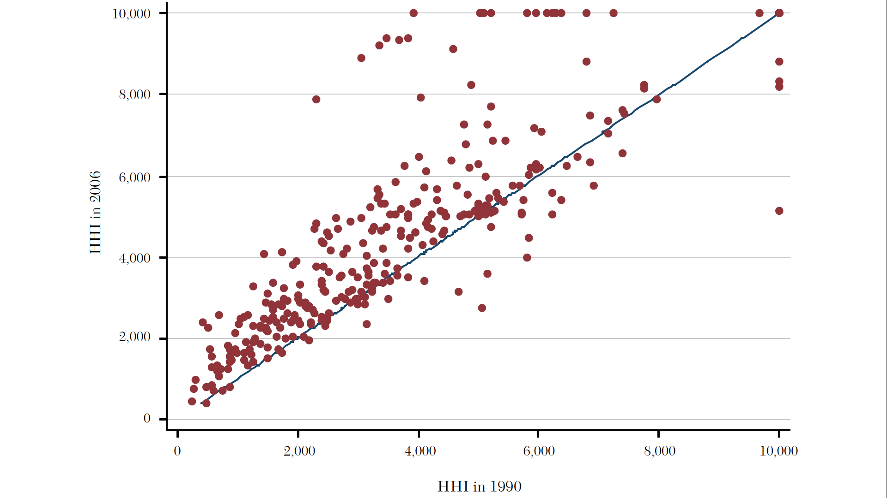
]

<div class="smalltext">Source: <a href="https://www.aeaweb.org/articles?id=10.1257/jel.53.2.235">Gaynor, Ho, and Town (2015). The Industrial Organization of Health Care Markets. Journal of Economic Literature.</a></div>


---
# Effects of reduced competition
1. Higher prices
2. Lower quality, [2020 NEJM Paper](https://www.nejm.org/doi/full/10.1056/NEJMsa1901383)
3. Maybe lower costs (but not passed on to lower prices)<br>


---
# Why?
Historical perception of hospital competition as "wasteful" and assumption that more capacity means more (unnecessary) care:
- Certificate of need laws
- Certificate of public advantage
- Scope of practice laws
- Any willing provider laws
- Site-based payment differentials (encourage vertical integration)


---
# Where do we go frome here?

1. Adopt sensible policies

2. Antitrust enforcement


<!-- New Section -->
---
class: inverse, center, middle
name: emory

# What are we doing at Emory?

<html><div style='float:left'></div><hr color='#EB811B' size=1px width=1055px></html>


---
# Health economics at Emory

Graduate program:
- Economics program focus on health as a subfield of economics
- 20-30% of our graduate students are specifically interested in health

Undergraduate program:
- Significant interest in health policy and pre-med
- Recent launch of joint major in economics and human health
- 35 majors right now

Rollins School
- Strong collaboration with Department of Health Policy and Management
- Coauthorship
- Classes and graduate student committees

---
# Some success stories

- Undergraduate: 
    - Many examples of placements in health-related companies (startups, consulting, Aetna)
    - MPH at Johns Hopkins and Michigan
    - Harvard Law School and Harvard Medical School
    - Rising senior in Econ-HH, featured speaker at Georgia CTSA Conference and accepted to World Stroke Conference in Singapore
- Econ PhD Graduate:
    - Eric Nesson (Ball State)
    - James Robinson (UAB)
    - Otto Lenhart (Glasgow)
    - Kaylyn Sanbower (U.S. Department of Justice)
- Rollins PhD Graduate:
    - Lindsay Allen (WVU, now Northwestern)
    - Manasvini Singh (UMass Amherst)
