<!-- Adjust some CSS code for font size, maintain R code font size -->
<style type="text/css">
.remark-slide-content {
    font-size: 30px;
    padding: 1em 2em 1em 2em;    
}
.remark-code, .remark-inline-code { 
    font-size: 20px;
}
</style>


<!-- Set R options for how code chunks are displayed and load packages -->
```{r setup, include=FALSE}
options(htmltools.dir.version = FALSE)
options(dplyr.summarise.inform = FALSE)
library(knitr)
opts_chunk$set(
  fig.align="center",  
  fig.height=3, #fig.width=6,
  # out.width="748px", #out.length="520.75px",
  dpi=300, #fig.path='Figs/',
  cache=T#, echo=F, warning=F, message=F
  )

knitr::opts_hooks$set(fig.callout = function(options) {
  if(options$fig.callout) {
    options$echo = FALSE
  }
  options
})

if (!require("pacman")) install.packages("pacman")
pacman::p_load(tidyverse, ggplot2, dplyr, lubridate, readr, readxl, hrbrthemes,
               scales, gganimate, gapminder, gifski, png, tufte, plotly, OECD,
               ggrepel, xaringanExtra)
```


```{r xaringan-scribble, echo=FALSE}
xaringanExtra::use_scribble(rgb(0.9, 0.5, 0.5))
```

# Health care in the U.S.

.center[
<iframe width="800" height="500" src="https://www.youtube.com/embed/u2AFI_M-QGg?start=135&end=197" frameborder="0" allowfullscreen></iframe>
]

---
class: inverse

# Some thought on U.S. health care...

1. [Quality is "Meh"](#health)

2. [The System is Confusing](#complex)

3. [Economics can help](#economics)


<!-- New Section -->
---
class: inverse, center, middle
name: health

# Spending and Quality

<html><div style='float:left'></div><hr color='#EB811B' size=1px width=1055px></html>

---
# Health improvements worldwide

We've made *major* improvements in life expectancy (and many other measures of health) across the world

- Poverty reduction
- Technology development and innovation
- Technology diffusion and adoption
- Access to better services, including health care


---
# Health improvements worldwide

```{r life-exp, include=FALSE}
library(gapminder)
gapminder %>%
  group_by(year) %>%
  summarize(lifeExp = median(lifeExp),
            gdpMed = median(gdpPercap)) %>%
  ggplot(aes(year,lifeExp)) + geom_line(alpha = 1/3) + theme_bw() +
    labs(x = "Year",
         y = "Life Expectancy (years)",
         title = "Median life expectancy across the world")
```


```{r life-exp-full-output, ref.label="life-exp", fig.callout=TRUE}
```


---
# Health improvements related to economic growth

```{r lifexp-gdp, include=FALSE}
library(gapminder)
ggplot(data = gapminder, mapping = aes(x = gdpPercap, y = lifeExp)) + 
  geom_point(size = 1) + theme_bw() + scale_x_continuous(label = comma) +
  labs(x = "GDP Per Capita ($US)",
       y = "Life Expectancy (years)",
       title = "Life expectancy and GDP")
```


```{r lifexp-full-output, ref.label="lifexp-gdp", fig.callout=TRUE}
```


---
# Health improvements related to economic growth

```{r gganim1, message=FALSE, warning=FALSE, include=FALSE}
anim1 <- ggplot(gapminder, aes(gdpPercap, lifeExp, size = pop)) +
  geom_point(alpha = 0.5, show.legend = FALSE) +
  scale_colour_manual(values = country_colors) +
  scale_size(range = c(2, 12)) +
  scale_x_log10() +
  facet_wrap(~continent) +
  labs(title = 'Year: {frame_time}', x = 'Log GDP Per Capita ($US)', y = 'Life Expectancy (years)') +
  transition_time(year) +
  ease_aes('linear')

anim_save("images/anim1.gif",anim1)
```

.center[
  
]

---
# But the U.S. is unique

```{r us-gap, message=FALSE, warning=FALSE, include=FALSE}
mycolors <- c("US" = "red", "other" = "grey50")
anim2 <- gapminder %>% filter(country %in% c("Canada", "France", "Germany", "Italy", "Japan", "United Kingdom", "United States")) %>%
  mutate(highlight = ifelse(country=="United States", "US", "other")) %>%
  ggplot(aes(gdpPercap, lifeExp, size = pop)) +
  geom_point(alpha = 0.5, show.legend = FALSE, aes(color=highlight)) +
  scale_color_manual("U.S.", values = mycolors) +
  scale_size(range = c(2, 12)) +
  scale_x_comma(limits=c(0,55000)) + 
  labs(title = 'Year: {frame_time}', x = 'GDP Per Capita ($US)', y = 'Life Expectancy (years)') +
  transition_time(year) +
  ease_aes('linear')

anim_save("images/anim2.gif",anim2)
```

.center[
  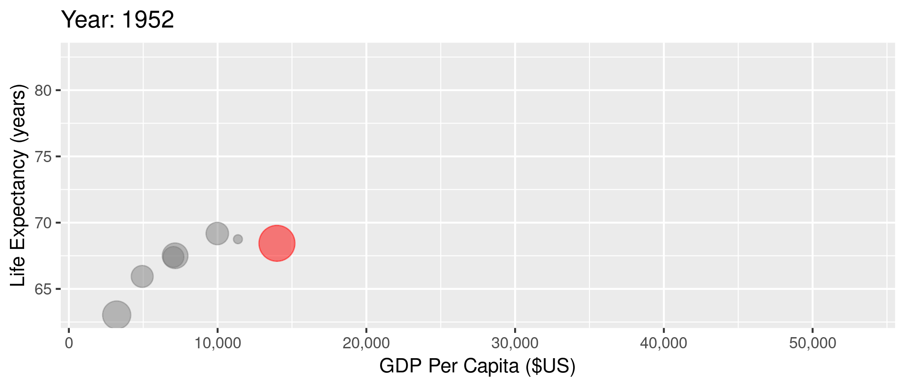
]


---
# The U.S. has very high spending

```{r include=FALSE}
search_dataset("health",get_datasets())
oecd.str1 <- get_data_structure("SHA")
oecd.str2 <- get_data_structure("HEALTH_STAT")
oecd.exp <- get_dataset("SHA", filter=list("HFTOT", "HCTOT", "HPTOT", "PARPIB"))
oecd.health <- get_dataset("HEALTH_STAT", filter=list(c("MATIINFA","MATIMATM")))

health.dat <- oecd.health %>%
  filter(COU %in% c("USA", "GBR", "CAN", "FRA", "DEU", "ITA", "JPN")) %>%
  select(VAR, year = obsTime, value = obsValue, country = COU)
health.dat <- pivot_wider(health.dat, id_cols = c("year", "country"),
                          names_from = VAR, 
                          values_from = value) %>%
  rename(mort_inf = MATIINFA, mort_mat = MATIMATM)

exp.dat <- oecd.exp %>%
  filter(LOCATION %in% c("USA", "GBR", "CAN", "FRA", "DEU", "ITA", "JPN")) %>%
  select(year = obsTime, tot_exp = obsValue, country = LOCATION)

oecd.dat <- health.dat %>%
  left_join(exp.dat, by=c("year", "country")) %>%
  mutate(year=as.integer(year))

```

```{r spend, echo=FALSE, message=FALSE, warning=FALSE}
oecd.dat %>% filter(year>=1970) %>%
  ggplot(aes(x=year,y=tot_exp,color=country)) + 
  geom_line(show.legend = FALSE) + theme_bw() +
  geom_text_repel(data = oecd.dat %>% filter(year == 2014), 
            aes(label = country,
                x = year + 1,
                y = tot_exp),
            show.legend = FALSE) +
  guides(linecolor=FALSE) +
  labs(
    x="Year",
    y="Spending as Share of GDP",
    title="Health Care Spending over Time"
  ) + xlim(1970, 2017)
```


---
# And our spending doesn't pay off in some areas

```{r spend-inf-mort, message=FALSE, warning=FALSE, include=FALSE}
anim4 <- oecd.dat %>% filter(year>=1970) %>% group_by(country) %>% fill(c(tot_exp, mort_inf), .direction="updown") %>%
  ggplot(aes(tot_exp, mort_inf, label=country)) +
  geom_text(aes(size=3), show.legend=FALSE) + theme_bw() + 
  labs(title = 'Year: {frame_time}', x = 'Health Care Spending (%GDP)', y = 'Infant Mortality') +
  transition_time(year) +
  ease_aes('linear')
anim_save("images/anim4.gif",anim4)
```

.center[
  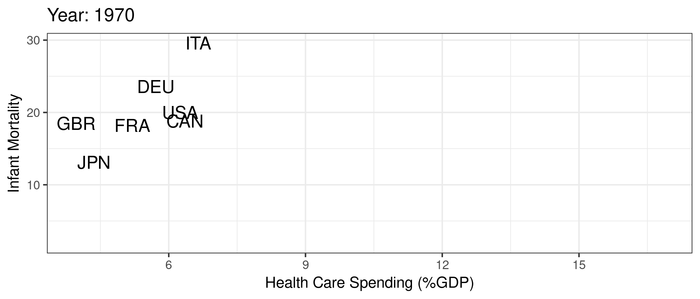
]


---
# And our spending doesn't pay off in some areas

```{r spend-mat-mort, message=FALSE, warning=FALSE, include=FALSE}
anim5 <- oecd.dat %>% filter(year>=1970 & year<=2012) %>% group_by(country) %>% fill(c(tot_exp, mort_mat), .direction="updown") %>%
  ggplot(aes(tot_exp, mort_mat, label=country)) +
  geom_text(aes(size=3), show.legend=FALSE) + theme_bw() + 
  labs(title = 'Year: {frame_time}', x = 'Health Care Spending (%GDP)', y = 'Maternal Mortality') +
  transition_time(year) +
  ease_aes('linear')
anim_save("images/anim5.gif",anim5)
```

.center[
  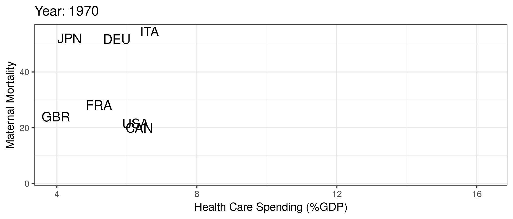
]


<!-- New Section -->
---
class: inverse, center, middle
name: complex

# U.S. Health Care is Confusing!

<html><div style='float:left'></div><hr color='#EB811B' size=1px width=1055px></html>


---
class: clear, middle

> *"Nobody knew health care could be so complicated"*
> `r tufte::quote_footer('-- Donald Trump')`


---
# Fragmentation

A common criticism of U.S. health care is that it is extremely fragmented:
- different ways to get insurance
- mix of providers, organizational structures, and reliance on referrals
- separate billing (for the most part)


---
class: clear, middle

**What does all this complexity mean?**

---
# 1. Too many uninsured

.center[
  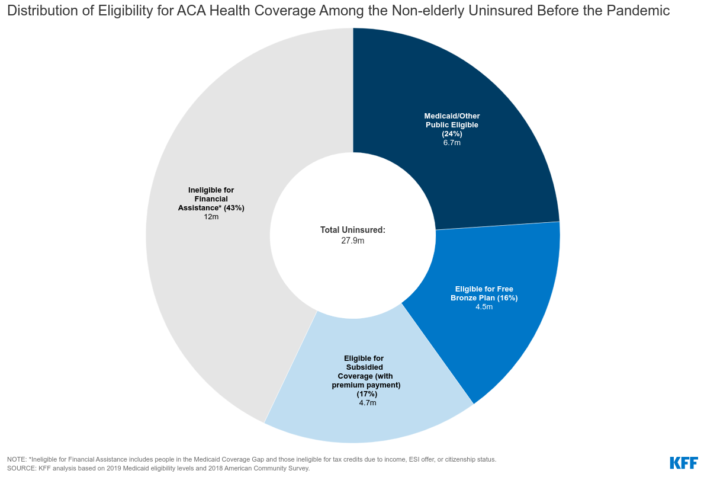
]


---
# 2. Variation in health care delivery and spending

.pull-left[
  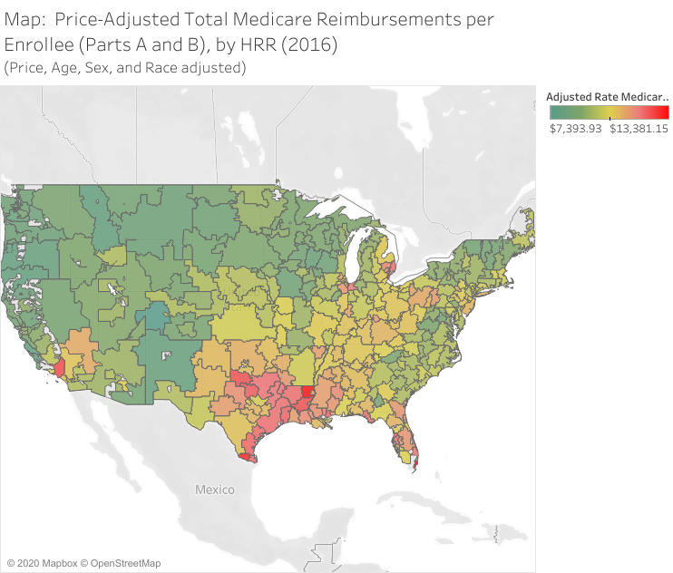
]

.pull-right[
  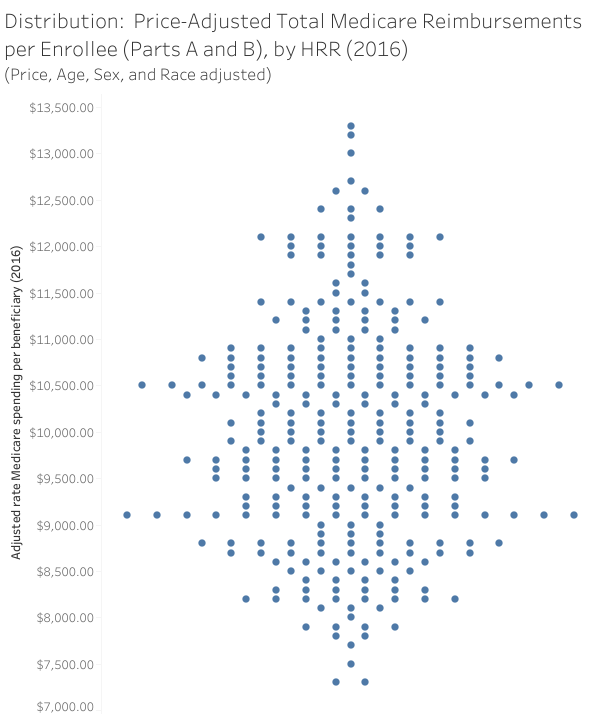
]

---
# 3. Really high prices

.center[
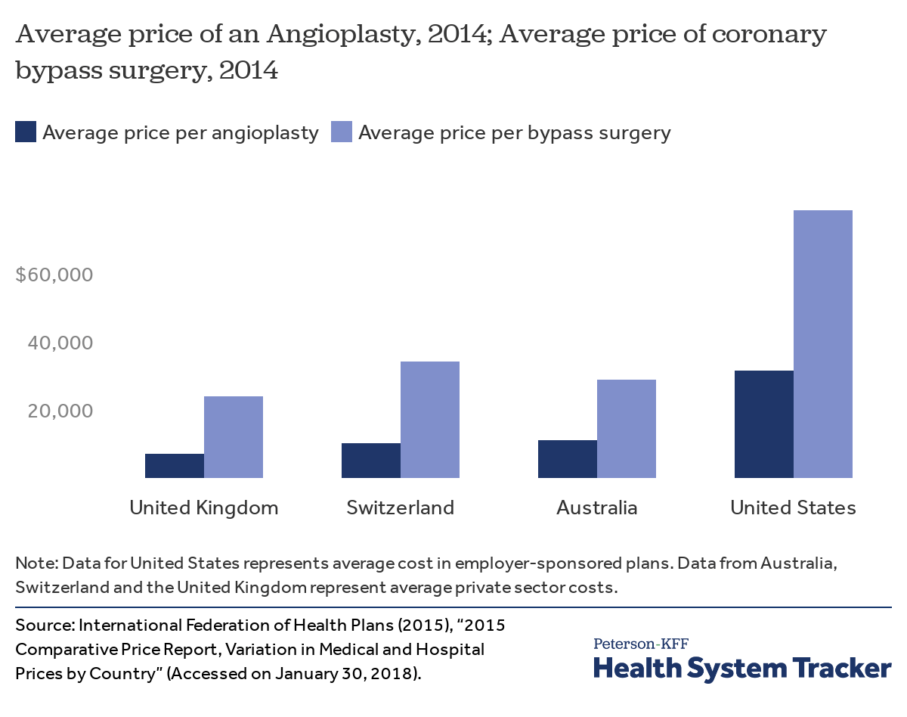
]

---
# 3. Really high prices

.center[
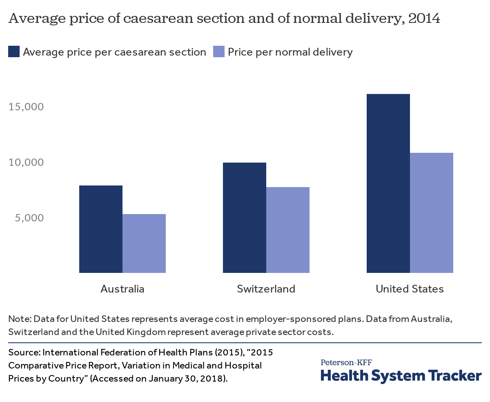
]

---
# 3. Really high prices

.center[
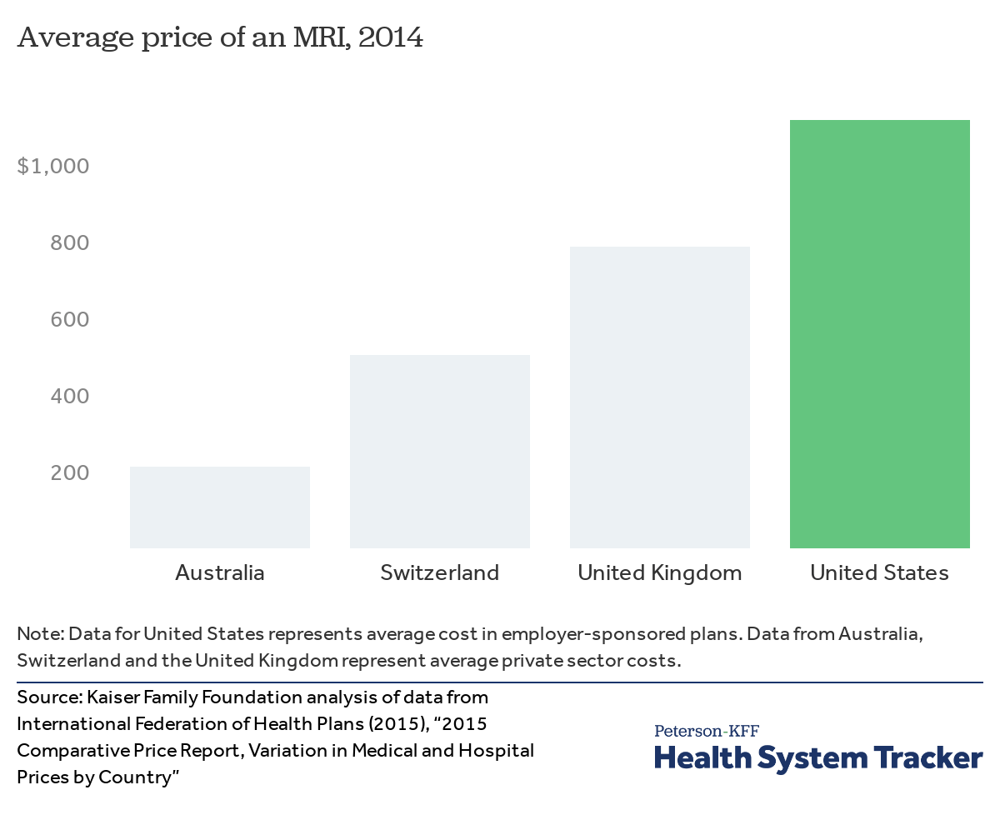
]

---
# 3. Really high prices

.center[

]

---
# 3. Really high prices

.center[
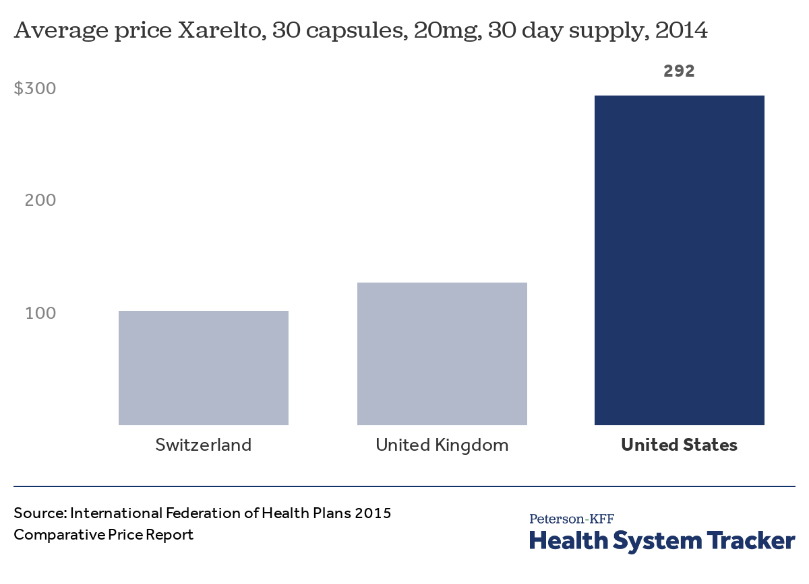
]


---
# 4. Confusing pricing

Our fragmented system has led to a ridiculously complex and convoluted billing process

--

.center[
  
]

<div class="smalltext">Brill, Steven. 2013. "Bitter Pill: Why Medical Bills are Killing Us." *Time Magazine*.</div>


---
# 4. Confusing pricing

Confusing because there are lots of definitions for a "price":

- Negotiation with private insurers (bargaining problem)
- Set payment from Medicare and Medicaid
  - Medicaid managed care (80%)
  - Medicare Advantage (45%)
- Uninsured patients (charge amounts)

--

.center[
Price $\neq$ charge $\neq$ cost $\neq$ patient out-of-pocket spending
]


---
# 4. Confusing pricing

.center[
  
]

<div class="smalltext">Source: <a href="https://healthcarepricingproject.org/">Health Care Pricing Project</a></div>


---
# 5. Crazy billing practices

.center[
  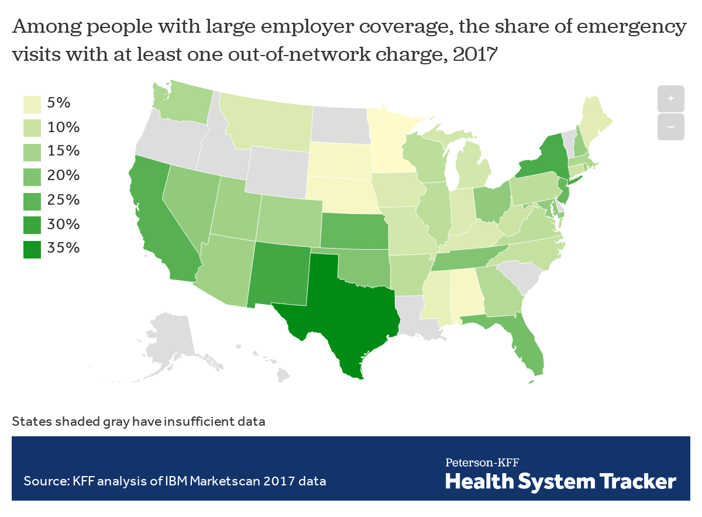
]


---
# 5. Crazy billing practices

.center[
  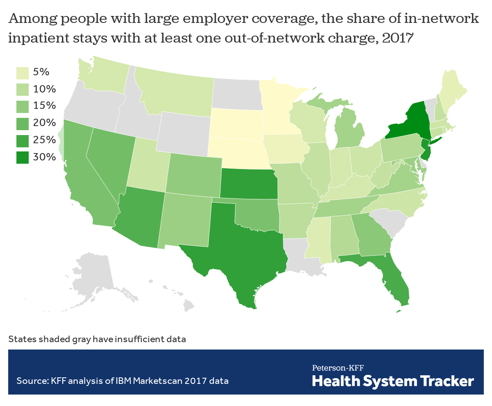
]

---
# 5. Crazy billing practices

Some hope here following the **No Surprises Act** (in effect January 2022):
- Emergency care (excluding ground ambulances?)
- In-network facilities
- New process...
  - OON provider bills health plan
  - Health plan communicates median in-network amount
  - Provider bills cost-sharing to patient


--

- **But** patient can be asked to waive rights


<!-- New Section -->
---
class: inverse, center, middle
name: economics

# Where does economics fit in here?

<html><div style='float:left'></div><hr color='#EB811B' size=1px width=1055px></html>


---
# Health care and economics (in general)

Lots of interesting economic issues in health care (not all unique to the U.S.):

--

1. Extremely heterogeneous products
2. Asymmetric information between patients and physicians
3. Unobservable quality (experience good)
4. Unpredictable need (inability to shop in many cases)
5. Distortion of incentives due to insurance
6. Adverse selection (asymmetric information between patients and insurers)

---
# How is the U.S. unique?

These factors exist in other markets and in other countries, but...


--

- Health care is unique in the combination of these issues
- U.S. is unique in the extent of these issues in health care (policy problems)
- We have a market based system but **without sufficient competition**...


---
# Trends in competitiveness
Almost any way you define it, hospital markets are more and more concentrated (less competitive) in recent decades.
- 1990: 65% of MSAs highly concentrated, 23% unconcentrated
- 2006: 77% highly concentrated, 11% unconcentrated


---
# Hospital concentration over time

.pull-left[
  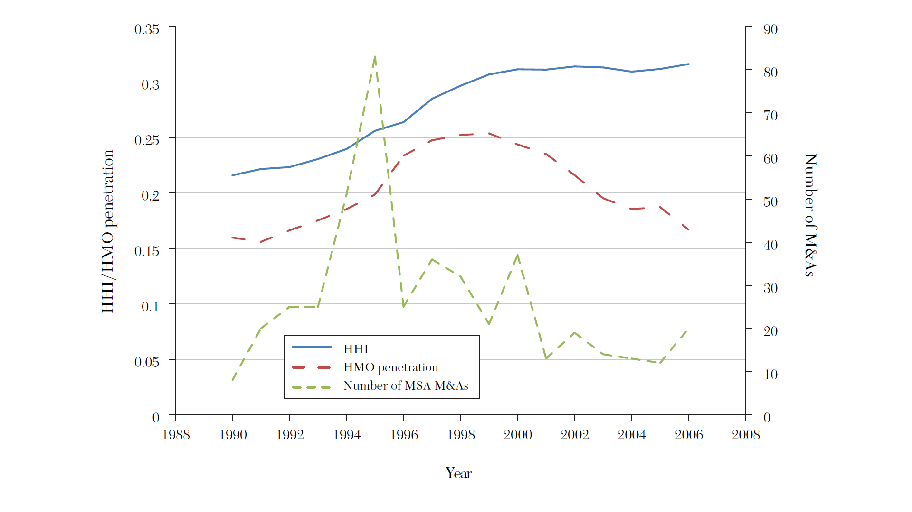
]

.pull-right[
  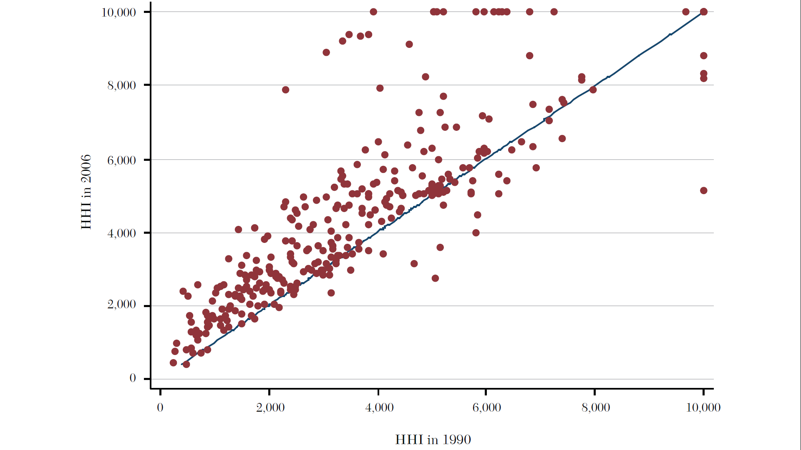
]

<div class="smalltext">Source: <a href="https://www.aeaweb.org/articles?id=10.1257/jel.53.2.235">Gaynor, Ho, and Town (2015). The Industrial Organization of Health Care Markets. Journal of Economic Literature.</a></div>

---
# Hospital concentration over time

- More recent data on hospital market concentration from the [Health Care Cost Institute](https://healthcostinstitute.org/hcci-originals/hmi-interactive#HMI-Concentration-Index)

---
# Types of hospitals involved in mergers

.center[
  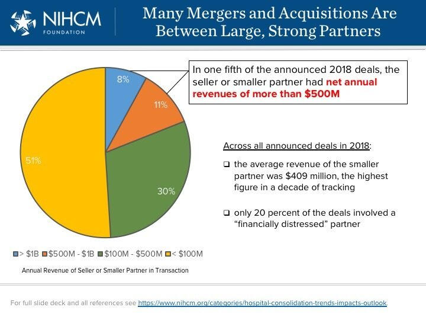
]


---
# Types of hospitals involved in mergers

- Ascension-Presence: Largest non-profit system in US adds 10 hospitals to existing 9 hospitals in Chicago
- Fairview-HealthEast: 11 hospital system becomes largest in Twin Cities area
- Hospital corporation of america (HCA) adds 4 hospitals to the 10 existing HCA hospitals in Houston
- Northwestern-Centegra: Forms 10 hospital system in Chicago
- Emory-DeKalb: Forms 10 hospital system in Atlanta
- Jefferson-Einstein: Forms 18 hospital system in Philadelphia area


.footnote[Source: NIHCM Hospital Consolidation Trends]


---
# Different merger types

Essentially two types of mergers:

1. "Within-market"
2. "Out-of-market"


---
# Within-market mergers

- **Big** price effects
  - 20 to 40% in many studies
  - Up to 60% in some studies
  - Bigger increases the closer are the hospitals
  - Price increases spillover to other hospitals too
- Account for about 50% of all mergers since 2000


---
# Out-of-market mergers

- Involve larger systems spanning different isolated markets
  - Advocate-Aurora: 27 hospital system in IL and WI
  - Baptist Memorial-Mississippi Baptist: 22 hospitals in TN, AR, and MS
  - UPMC-Pinnacle: 24 hospital system recently added 8 in central PA
  - Catholic Health Initiatives-Dignity Health: 142 hospitals in 21 states
  - HCA: 177 hospitals in 21 states
  - RCCH HealthCare Partners: 89 hospitals in 30 states, focusing on non-urban areas
- About 35% of all mergers are out-of-market but in same state, 15% out-of-state
- Smaller but meaningful price increases, 5 to 10%

---
# 1. Out of market mergers and common customers
.center[
  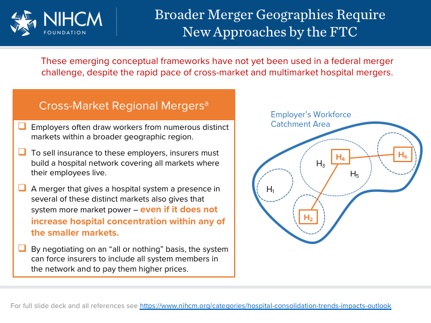
]

---
# 2. Out of market mergers and multimarket contact
.center[
  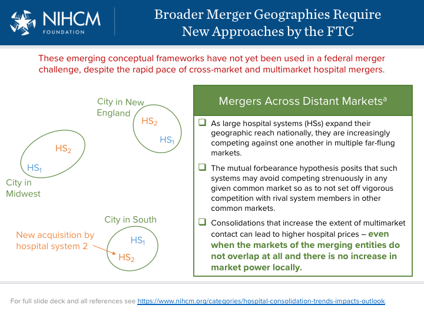
]

---
# Effects of reduced competition
1. Higher prices
2. Lower quality, [2020 NEJM Paper](https://www.nejm.org/doi/full/10.1056/NEJMsa1901383)
3. Maybe lower costs (but not passed on to lower prices)<br>


---
# Why?
Historical perception of hospital competition as "wasteful" and assumption that more capacity means more (unnecessary) care:
- Certificate of need laws
- Certificate of public advantage
- Scope of practice laws
- Any willing provider laws
- Site-based payment differentials (encourage vertical integration)


---
# Where do we go frome here?

1. Adopt sensible policies

2. Antitrust enforcement


---
class: clear, center


